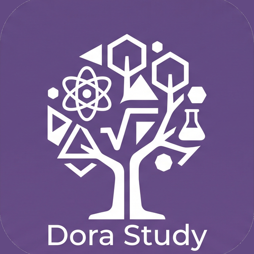

<div align="center">
  
  <h1>阿蔓明道國中復習專班</h1>
  <p>明道國中 · 數學・物理・化學 複習教材</p>
  <p><strong>V2.1.3</strong></p>
</div>

---

## 這是什麼

給明道國中學生阿蔓的數理化複習網站（品牌 **Dora Study**）。純靜態（HTML + CSS + 原生 JS），**PWA 可安裝**，GitHub Pages 託管。薰衣草紫設計系統見 `DESIGN.md`，建課流程見 `COURSE-SYSTEM.md`。

---

## 版本歷程

### V2.1.3 — 2026.06 — 程式內雙 logo
- 首頁 hero 加入 Dora Study app logo、footer 加 SELA 製作者署名（雙軌歸屬入站內）
- 補上 V2.1.0 換色漏網的 sticky 頂欄/底欄 rgba 舊色 → 薰衣草

### V2.1.0 — 2026.06 — Dora Study app logo + PWA + 薰衣草配色
- 整合 Dora Study app logo（從 Gemini 生圖抽出、轉多尺寸套組，取代 SELA favicon 為主視覺）
- 全站轉 **PWA**：客製 manifest（可安裝）+ service worker（離線快取）+ 各頁註冊
- **全站主色調改薰衣草紫系**（國中女生向）：霧紫底 + 矢車菊紫(數)/薄荷(物)/蘭花(化) accent，保留綠=對/紅玫瑰=警告語意
- SELA logo 依雙軌系統降為 README footer 品牌歸屬
- theme-color → 品牌紫 `#634A83`；DESIGN.md 同步更新薰衣草色票

### V2.0.0 — 2026.06 — 對齊 SELA-Kit（大升級里程碑）
- 英文化 StudyBase、補 favicon、`.gitignore`、`CLAUDE.md`、`SELA-handoff.md`、版號嚴格三位

### V1.8 — 2026.06
- 數學第一章 相似形整合

### V1.7 ～ V1.0 — 2026.03
- 化學五～七章、第一次段考詳解、北歐美學建站、設計規格書

---

## 部署到 GitHub Pages

用 Git Pusher 匯入 `StudyBase V2.1.3.zip` → 推 main，然後 Settings → Pages → Source: main → `/(root)`。約 1-2 分鐘上線。PWA 在 HTTPS 的 Pages 上才會出現「加入主畫面 / 安裝」。

---

## 檔案結構

```
StudyBase/
├── index.html              ← 首頁（類型 A）
├── css/main.css            ← 類型 A 共用樣式（薰衣草設計系統）
├── chemistry/ math/ physics/   ← 三科主頁 + 章節（類型 B）/ 段考（類型 C）
├── favicon/                ← Dora Study app logo 多尺寸套組 + manifest + sela.svg(歸屬用)
├── sw.js                   ← PWA service worker（離線快取）
├── DESIGN.md               ← 薰衣草設計規格書（真相）
├── CLAUDE.md               ← 給下個 Claude 的工作上下文
├── SELA-handoff.md         ← Kit 對齊回流摘要
├── SELA-logo-prompt.md     ← app logo 生成 prompt（已生成、保留紀錄）
├── .gitignore
└── README.md
```

---

<div align="center">
  <sub>Made with <strong>Claude</strong> · </sub>
  
  <sub> <strong>by SELA</strong></sub>
</div>
